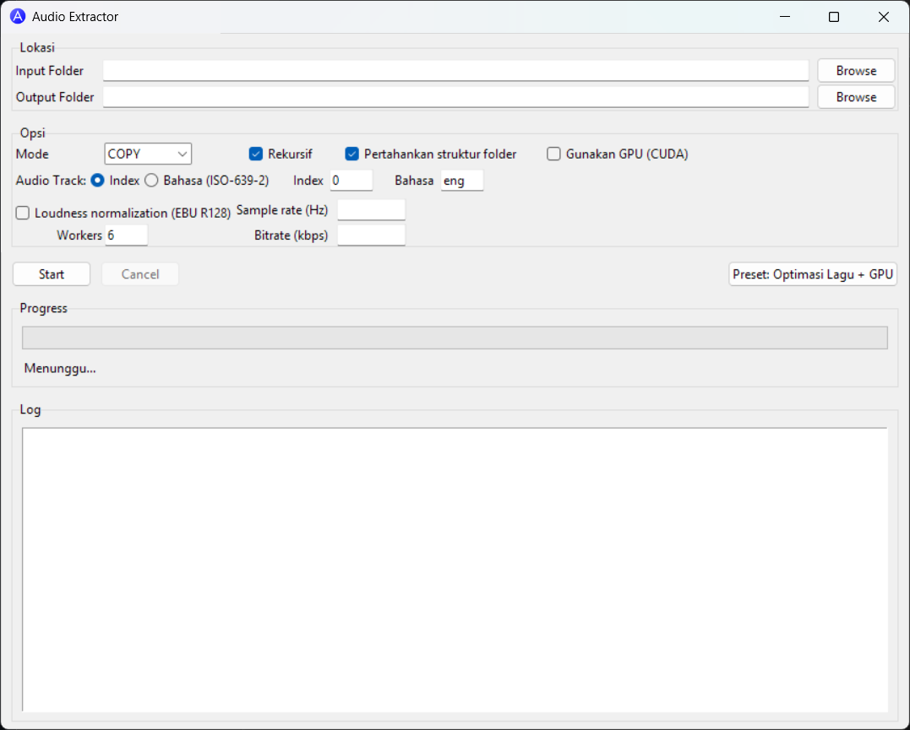

# 🎵 Audio Extractor GUI

Audio Extractor adalah aplikasi berbasis Python + Tkinter untuk mengekstrak audio dari file video secara **massal** dengan antarmuka yang ramah pengguna.  
Mendukung **GPU Acceleration (CUDA)** untuk konversi cepat, preset optimasi untuk lagu, dan berbagai opsi teknis seperti bitrate, sample rate, serta normalisasi audio.

## 🖼 Tampilan



## 📊 Diagram Alur Proses

```bash
+---------------------+
| Pilih Folder Sumber |
+---------------------+
          |
          v
+------------------------------+
| Pilih Format Audio & Opsi    |
| - Format (MP3, WAV, FLAC)    |
| - Bitrate & Sample Rate      |
| - Normalisasi (EBU R128)     |
| - Rekursif (Subfolder)       |
+------------------------------+
          |
          v
+------------------------------+
| Aktifkan GPU Acceleration?   |
+------------------------------+
       /           \
      v             v
+----------------+  +----------------+
| Gunakan CUDA   |  | Proses via CPU |
| (NVENC/NVDEC)  |  +----------------+
+----------------+
       |
       v
+-------------------------+
| Preset Optimasi Lagu    |
| (Opsional)              |
+-------------------------+
          |
          v
+-------------------------+
| Eksekusi FFmpeg         |
+-------------------------+
          |
          v
+-------------------------+
| Simpan Output Audio     |
+-------------------------+
          |
          v
+-------------------------+
|         Selesai         |
+-------------------------+
```

## ✨ Fitur Utama

- **Ekstraksi Massal**: Pilih banyak video sekaligus, proses otomatis semua.
- **Format Output Fleksibel**: MP3, WAV, FLAC, dan lainnya sesuai dukungan FFmpeg.
- **Preset Optimasi Lagu**: Pengaturan otomatis untuk kualitas musik terbaik.
- **GPU Acceleration (NVIDIA CUDA)**: Memanfaatkan GPU untuk proses lebih cepat.
- **Loudness Normalization (EBU R128)**: Volume audio lebih konsisten.
- **Opsi Bitrate & Sample Rate**: Atur sesuai kebutuhan.
- **Mode Rekursif**: Proses semua file di subfolder.
- **Antarmuka GUI Modern**: Tidak perlu hapal perintah FFmpeg.
- **Build Stabil**: Dibundle menggunakan cx_Freeze, tidak crash saat dijalankan.

## 📦 Instalasi & Build

### 1. Persiapan

Pastikan sudah menginstal:

- Python 3.12+
- FFmpeg (pastikan path FFmpeg sudah ada di `PATH` Windows)
- NVIDIA CUDA Toolkit (jika ingin GPU acceleration)
- Pip dependencies:

```bash
pip install cx_Freeze
```

### 2. Struktur Folder

```bash
project/
│
├── Extractor.py           # file utama
├── favicon.ico            # ikon file .exe
├── app.png                # ikon window aplikasi
├── setup.py               # script build cx_Freeze
```

### 3. Contoh setup.py

```python
from cx_Freeze import setup, Executable

build_options = {
    "include_files": ["favicon.ico", "app.png"],  # ikutkan resource
}

exe = Executable(
    script="AudioExtractorGUI.py",
    base="Win32GUI",                              # tanpa console
    target_name="AudioExtractor.exe",
    icon="favicon.ico"                            # ikon file .exe
)

setup(
    name="AudioExtractorGUI",
    version="1.0.0",
    description="Batch audio extractor GUI (FFmpeg)",
    options={"build_exe": build_options},
    executables=[exe]
)
```

### 4. Build Aplikasi

```bash
python setup.py build
```

Hasil build ada di:

```bash
build\exe.win-amd64-3.12\AudioExtractor.exe
```

## 🖥️ Cara Pakai

1. Jalankan `AudioExtractor.exe`.
2. Pilih **Folder Sumber** berisi video.
3. Pilih **Format Audio** (MP3 disarankan untuk musik).
4. Centang **Gunakan GPU (CUDA)** jika ingin akselerasi hardware.
5. Aktifkan **Preset Optimasi Lagu** untuk kualitas musik terbaik.
6. Atur opsi lain jika diperlukan:
   - **Bitrate (kbps)**: misalnya 320 untuk MP3 kualitas tinggi.
   - **Sample Rate (Hz)**: misalnya 44100 atau 48000.
   - **Loudness Normalization**: aktifkan jika ingin volume seragam.
   - **Rekursif**: untuk memproses semua file di subfolder.
7. Klik **Mulai Ekstraksi**.
8. Audio akan tersimpan di folder output.

## ⚡ Mode GPU (CUDA)

Jika dicentang **Gunakan GPU (CUDA)**:
- Encoder akan memakai **NVENC/NVDEC** untuk decoding video.
- Proses lebih cepat terutama untuk video resolusi tinggi.
- Membutuhkan driver NVIDIA terbaru + FFmpeg dengan dukungan CUDA.

## 📋 Preset Optimasi Lagu

Preset ini otomatis mengatur:
- Format: MP3
- Bitrate: 320 kbps
- Sample Rate: 44.1 kHz
- Stereo
- Normalisasi volume EBU R128

Tujuan: menghasilkan file musik dengan kualitas tinggi dan konsisten.

## 🛠 Troubleshooting

- **Ikon tidak muncul di window**  
  Pastikan `app.png` ada di folder yang sama dengan `.exe`.
- **FFmpeg tidak dikenali**  
  Tambahkan folder `bin` FFmpeg ke `PATH` Windows.
- **GPU mode tidak aktif**  
  Pastikan GPU NVIDIA terdeteksi dan FFmpeg mendukung NVENC.

## 📄 Lisensi

***MIT License © 2025 Ardean***